##1. Loading the data and packages


```r
full <- read.csv("titanic/train.csv", stringsAsFactors = T) #1:891 - fulling set
test <- read.csv("titanic/test.csv", stringsAsFactors = T) #892:1309 - test set
full <- bind_rows(full, test)
```

##3. Summary of the data


```r
str(full)
```

```
## 'data.frame':	1309 obs. of  12 variables:
##  $ PassengerId: int  1 2 3 4 5 6 7 8 9 10 ...
##  $ Survived   : int  0 1 1 1 0 0 0 0 1 1 ...
##  $ Pclass     : int  3 1 3 1 3 3 1 3 3 2 ...
##  $ Name       : chr  "Braund, Mr. Owen Harris" "Cumings, Mrs. John Bradley (Florence Briggs Thayer)" "Heikkinen, Miss. Laina" "Futrelle, Mrs. Jacques Heath (Lily May Peel)" ...
##  $ Sex        : Factor w/ 2 levels "female","male": 2 1 1 1 2 2 2 2 1 1 ...
##  $ Age        : num  22 38 26 35 35 NA 54 2 27 14 ...
##  $ SibSp      : int  1 1 0 1 0 0 0 3 0 1 ...
##  $ Parch      : int  0 0 0 0 0 0 0 1 2 0 ...
##  $ Ticket     : chr  "A/5 21171" "PC 17599" "STON/O2. 3101282" "113803" ...
##  $ Fare       : num  7.25 71.28 7.92 53.1 8.05 ...
##  $ Cabin      : chr  "" "C85" "" "C123" ...
##  $ Embarked   : chr  "S" "C" "S" "S" ...
```

```r
summary(full)
```

```
##   PassengerId      Survived          Pclass          Name          
##  Min.   :   1   Min.   :0.0000   Min.   :1.000   Length:1309       
##  1st Qu.: 328   1st Qu.:0.0000   1st Qu.:2.000   Class :character  
##  Median : 655   Median :0.0000   Median :3.000   Mode  :character  
##  Mean   : 655   Mean   :0.3838   Mean   :2.295                     
##  3rd Qu.: 982   3rd Qu.:1.0000   3rd Qu.:3.000                     
##  Max.   :1309   Max.   :1.0000   Max.   :3.000                     
##                 NA's   :418                                        
##      Sex           Age            SibSp            Parch      
##  female:466   Min.   : 0.17   Min.   :0.0000   Min.   :0.000  
##  male  :843   1st Qu.:21.00   1st Qu.:0.0000   1st Qu.:0.000  
##               Median :28.00   Median :0.0000   Median :0.000  
##               Mean   :29.88   Mean   :0.4989   Mean   :0.385  
##               3rd Qu.:39.00   3rd Qu.:1.0000   3rd Qu.:0.000  
##               Max.   :80.00   Max.   :8.0000   Max.   :9.000  
##               NA's   :263                                     
##     Ticket               Fare            Cabin          
##  Length:1309        Min.   :  0.000   Length:1309       
##  Class :character   1st Qu.:  7.896   Class :character  
##  Mode  :character   Median : 14.454   Mode  :character  
##                     Mean   : 33.295                     
##                     3rd Qu.: 31.275                     
##                     Max.   :512.329                     
##                     NA's   :1                           
##    Embarked        
##  Length:1309       
##  Class :character  
##  Mode  :character  
##                    
##                    
##                    
## 
```


```r
head(full)
```

```
##   PassengerId Survived Pclass
## 1           1        0      3
## 2           2        1      1
## 3           3        1      3
## 4           4        1      1
## 5           5        0      3
## 6           6        0      3
##                                                  Name    Sex Age SibSp
## 1                             Braund, Mr. Owen Harris   male  22     1
## 2 Cumings, Mrs. John Bradley (Florence Briggs Thayer) female  38     1
## 3                              Heikkinen, Miss. Laina female  26     0
## 4        Futrelle, Mrs. Jacques Heath (Lily May Peel) female  35     1
## 5                            Allen, Mr. William Henry   male  35     0
## 6                                    Moran, Mr. James   male  NA     0
##   Parch           Ticket    Fare Cabin Embarked
## 1     0        A/5 21171  7.2500              S
## 2     0         PC 17599 71.2833   C85        C
## 3     0 STON/O2. 3101282  7.9250              S
## 4     0           113803 53.1000  C123        S
## 5     0           373450  8.0500              S
## 6     0           330877  8.4583              Q
```

```r
tail(full)
```

```
##      PassengerId Survived Pclass                           Name    Sex
## 1304        1304       NA      3 Henriksson, Miss. Jenny Lovisa female
## 1305        1305       NA      3             Spector, Mr. Woolf   male
## 1306        1306       NA      1   Oliva y Ocana, Dona. Fermina female
## 1307        1307       NA      3   Saether, Mr. Simon Sivertsen   male
## 1308        1308       NA      3            Ware, Mr. Frederick   male
## 1309        1309       NA      3       Peter, Master. Michael J   male
##       Age SibSp Parch             Ticket     Fare Cabin Embarked
## 1304 28.0     0     0             347086   7.7750              S
## 1305   NA     0     0          A.5. 3236   8.0500              S
## 1306 39.0     0     0           PC 17758 108.9000  C105        C
## 1307 38.5     0     0 SOTON/O.Q. 3101262   7.2500              S
## 1308   NA     0     0             359309   8.0500              S
## 1309   NA     1     1               2668  22.3583              C
```

##4. Removing/replacing NAs

Alright, we got an idea about our fulling dataset.
We can see from summary analysis that we hava some NAs (or missing values). Let's check again with NAs plot using *missmap function*:


```r
missmap(full, col = c("white","darkblue"), legend = F,  main = "Missing Values")
```

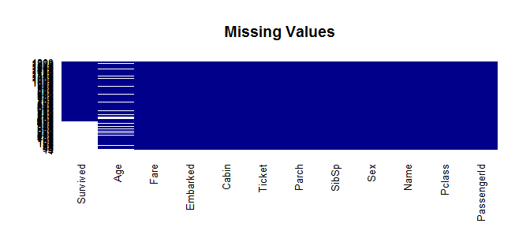<!-- -->

So, only Age varibale has some NAs which we should either ignore or replace with the actual values. Embarked and Cabin variables have also some empty values.

Let's start with the simple stuff and replace Embarked empty values with "S" - the most popular value and replacing missing Fare value with the average


```r
full$Embarked[full$Embarked == ""] <- "S"
full$Fare[is.na(full$Fare)] <- round(mean(full$Fare, na.rm = T),0)
full$Pclass <- as.factor(full$Pclass)
full$Survived <- as.factor(full$Survived)
full$Embarked <- as.factor(full$Embarked)
```

To fill Age NAs I'm gonna use random forest to predict the Age based on other characteristics

```r
full$Age.old <- full$Age
fit <- train(Age~Pclass + Sex + Embarked + SibSp + Parch + Fare, data = full[!is.na(full$Age),], method="rf", trControl=trainControl(method="cv", number=10))
new <- cbind(full[is.na(full$Age),], predict(fit, full[is.na(full$Age),]))
full$Age[is.na(full$Age)] <- new[,14]
full$Age <- as.numeric(full$Age)
```

```r
summary(full$Age)
```

```
##    Min. 1st Qu.  Median    Mean 3rd Qu.    Max. 
##    0.17   22.00   28.00   29.62   36.69   80.00
```

```r
summary(full$Embarked)
```

```
##   C   Q   S 
## 270 123 916
```

###5. Data Visualization

Now, let's visualise all variables and highlight Survivals vs. Non-Survivals among each of the characteristics to see the correlation.

##5.1. Ticket Class

All passengers were divided into 3 different classes - 1st, 2nd and 3d. The graph shows that people from the first class were more likely to survive and passengers from the thirs had the lowest chance.


```r
ggplot(data = full[!is.na(full$Survived),], aes(as.factor(Pclass), fill = as.factor(Survived))) +
     geom_bar(position = 'fill') +
     labs(x = "Ticket Class") +
     ggtitle("Survivals by the Ticket Class") +
     scale_fill_discrete(name = "Survived",
                         breaks = c(0,1),
                         labels = c("No", "Yes")) +
     theme(legend.position="top", plot.title = element_text(hjust = 0.5))
```

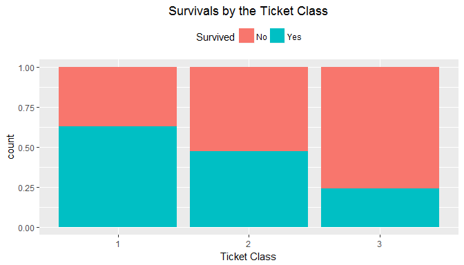<!-- -->

##5.2. Sex

Even stronger relationships are between gender and survival rate. Women were much more more likely to survive than


```r
ggplot(data = full[!is.na(full$Survived),], aes(Sex, fill = as.factor(Survived))) +
     geom_bar(position = 'fill') +
     labs(x = "Sex") +
     ggtitle("Survivals by the sex") +
     scale_fill_discrete(name = "Survived",
                         breaks = c(0,1),
                         labels = c("No", "Yes")) +
     theme(legend.position="top", plot.title = element_text(hjust = 0.5))
```

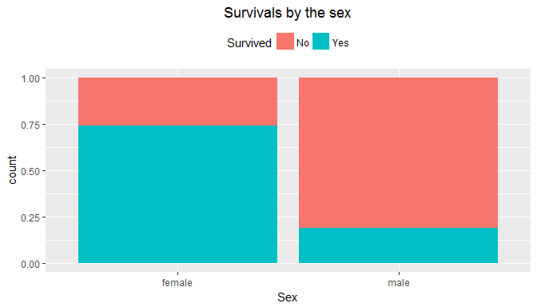<!-- -->

##5.3. Siblings, spouses, parents and children

Now we are looking at the number pf family members of each passanger and how this may have affected the survival rate.
We can see that the majority of people had 0 or 1 siblings or spouses and 0,1 or 2 parents/kids. The sample size of other variables is very small to take it into consideration. 

One interesting feature here is that people who had at least one family member had better chance. We can use this further in feature engineering to create a new variable identifing people with 1+ family member. 


```r
p1 <- ggplot(data = full[!is.na(full$Survived),], aes(as.factor(SibSp), fill = as.factor(Survived))) +
     geom_bar(position = 'fill') +
     labs(x = "Number of Siblings") +
     ggtitle("Survivals by the number of siblings/spouses") +
     scale_fill_discrete(name = "Survived",
                         breaks = c(0,1),
                         labels = c("No", "Yes")) +
     theme(legend.position="top", plot.title = element_text(hjust = 0.5))

p2 <- ggplot(data = full[!is.na(full$Survived),], aes(as.factor(Parch), fill = as.factor(Survived))) +
     geom_bar(position = 'fill') +
     labs(x = "Number of Parents/Children") +
     ggtitle("Survivals by the number of Parents/Children") +
     scale_fill_discrete(name = "Survived",
                         breaks = c(0,1),
                         labels = c("No", "Yes")) +
     theme(legend.position="top", plot.title = element_text(hjust = 0.5))

p3 <- ggplot(data = full[!is.na(full$Survived),], aes(as.factor(SibSp), fill = as.factor(Survived))) +
     geom_bar() +
     labs(x = "Number of Siblings") +
     ggtitle("Survivals by the number of siblings/spouses") +
     scale_fill_discrete(name = "Survived",
                         breaks = c(0,1),
                         labels = c("No", "Yes")) +
     theme(legend.position="top", plot.title = element_text(hjust = 0.5))

p4 <- ggplot(data = full[!is.na(full$Survived),], aes(as.factor(Parch), fill = as.factor(Survived))) +
     geom_bar() +
     labs(x = "Number of Parents/Children") +
     ggtitle("Survivals by the number of Parents/Children") +
     scale_fill_discrete(name = "Survived",
                         breaks = c(0,1),
                         labels = c("No", "Yes")) +
     theme(legend.position="top", plot.title = element_text(hjust = 0.5))
grid.arrange(p1,p2,p3,p4, nrow = 2, ncol = 2)
```

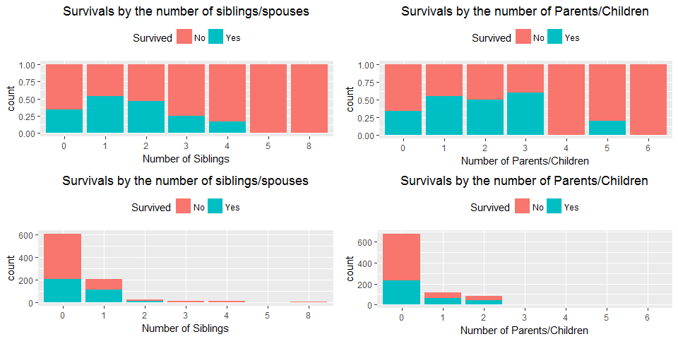<!-- -->

##5.4. Age

Below is the histogram of the Age variable with 2 density lines (Red is for non-survivavls and the green one is fro survivals).
Interesting to notice that the dendsity line of survivals is slightly skewed to the left compared to the red line, which means that yonger passangers were more likely to survive (which actually works well with our statement that women had also better chance - *women and kids were to be saved first*)  


```r
ggplot(data = full[!is.na(full$Survived),], aes(x = Age, fill = as.factor(Survived))) +
     geom_histogram(bins = 15, aes(y = ..density..)) +
     labs(x = "Number of Siblings") +
     ggtitle("Survivals by age") +
     scale_fill_discrete(name = "Survived",
                         breaks = c(0,1),
                         labels = c("No", "Yes")) +
     theme(legend.position="top", plot.title = element_text(hjust = 0.5)) +
     stat_function(fun = dnorm, 
                args = list(mean = mean(full$Age[full$Survived == "0"]), sd = sd(full$Age[full$Survived == "0"])), 
                lwd = 1, 
                col = 'red') + 
     stat_function(fun = dnorm, 
                args = list(mean = mean(full$Age[full$Survived == "1"]), sd = sd(full$Age[full$Survived == "1"])), 
                lwd = 1, 
                col = 'darkgreen')
```

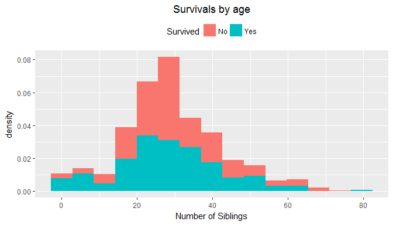<!-- -->

##5.5. Embarked

And lastly I'm gonna plot survivals by the port of embarkation. We can see that the port of embarkation have slight impact ofthe survival rate (passengers who embarked in Cherbourg have slightly higher survival rate compared to those who embarked in Southhampton). 
This also could be explain, for example, that many women embarked in Cherbourg or people from the first class etc. So we should explore this more, but I will leave this by now.


```r
p5 <- ggplot(data = full[!is.na(full$Survived),], aes(Embarked, fill = as.factor(Survived))) +
     geom_bar(position = 'fill') +
     labs(x = "Port of Embarkation") +
     ggtitle("Survivals by port of Embarkation") +
     scale_fill_discrete(name = "Survived",
                         breaks = c(0,1),
                         labels = c("No", "Yes")) +
     theme(legend.position="top", plot.title = element_text(hjust = 0.5))

p6 <- ggplot(data = full[!is.na(full$Survived),], aes(Embarked, fill = as.factor(Survived))) +
     geom_bar() +
     labs(x = "Port of Embarkation") +
     ggtitle("Survivals by port of Embarkation") +
     scale_fill_discrete(name = "Survived",
                         breaks = c(0,1),
                         labels = c("No", "Yes")) +
     theme(legend.position="top", plot.title = element_text(hjust = 0.5))

grid.arrange(p5,p6, ncol = 2)
```

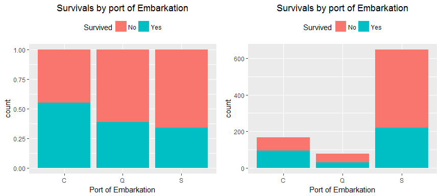<!-- -->

So we looked at all variables and got an idea of the data distribution and the impact of some of the variables on the survivals rate.
Next step is feature engineering!

##5. Feature Engineering

Let's see what else can we get from the data.

###5.1 Titles


```r
head(full$Name, n = 10)
```

```
##  [1] "Braund, Mr. Owen Harris"                            
##  [2] "Cumings, Mrs. John Bradley (Florence Briggs Thayer)"
##  [3] "Heikkinen, Miss. Laina"                             
##  [4] "Futrelle, Mrs. Jacques Heath (Lily May Peel)"       
##  [5] "Allen, Mr. William Henry"                           
##  [6] "Moran, Mr. James"                                   
##  [7] "McCarthy, Mr. Timothy J"                            
##  [8] "Palsson, Master. Gosta Leonard"                     
##  [9] "Johnson, Mrs. Oscar W (Elisabeth Vilhelmina Berg)"  
## [10] "Nasser, Mrs. Nicholas (Adele Achem)"
```

We can see the pattern that each name includes the passanger title (Mr., Mrs., Master etc.). Let's extract this infrmation and create a new variable **Title**:


```r
full$Title[grepl("Mr\\.", full$Name, ignore.case = T)] <- "Mr"
full$Title[grepl("Miss\\.|Mlle\\.|Ms\\.|Mme\\.", full$Name, ignore.case = T)] <- "Miss" 
full$Title[grepl("Mrs\\.", full$Name, ignore.case = T)] <- "Mrs"   
full$Title[grepl("Master\\.", full$Name, ignore.case = T)] <- "Master"  
full$Title[grepl("Don\\.", full$Name, ignore.case = T)] <- "Rare"
full$Title[grepl("Rev\\.", full$Name, ignore.case = T)] <- "Rare"
full$Title[grepl("Dr\\.", full$Name, ignore.case = T)] <- "Rare"
full$Title[grepl("Capt\\.", full$Name, ignore.case = T)] <- "Rare"
full$Title[grepl("Col\\.", full$Name, ignore.case = T)] <- "Rare"
full$Title[grepl("Sir\\.", full$Name, ignore.case = T)] <- "Rare"
full$Title[grepl("Major\\.", full$Name, ignore.case = T)] <- "Rare"
full$Title[grepl("Jonkheer\\.", full$Name, ignore.case = T)] <- "Rare"
full$Title[grepl("Countess\\.", full$Name, ignore.case = T)] <- "Rare"
full$Title[grepl("Lady\\.", full$Name, ignore.case = T)] <- "Rare"
full$Title[grepl("Dona\\.", full$Name, ignore.case = T)] <- "Rare"
full$Title <- as.factor(full$Title)
```

Alright! So we grouped up all the titles into categories [I also grouped all rare titles in Rare group]. Lets look at our result:


```r
summary(full$Title)
```

```
## Master   Miss     Mr    Mrs   Rare 
##     61    265    757    197     29
```

and let's visualize it:


```r
ggplot(data = full[!is.na(full$Survived),], aes(as.factor(Title), fill = as.factor(Survived))) +
     geom_bar(position = 'fill') +
     labs(x = "Title") +
     ggtitle("Survivals by the Title") +
     scale_fill_discrete(name = "Survived",
                         breaks = c(0,1),
                         labels = c("No", "Yes")) +
     theme(legend.position="top", plot.title = element_text(hjust = 0.5))
```

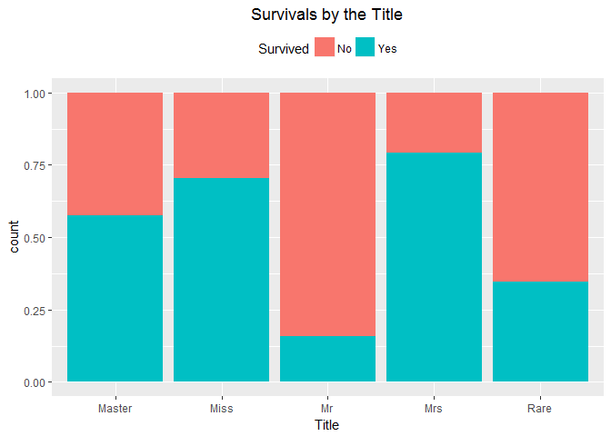<!-- -->


```r
full %>% group_by(Title) %>% summarise(mean.age = mean(Age))
```

```
## # A tibble: 5 x 2
##    Title  mean.age
##   <fctr>     <dbl>
## 1 Master  7.149111
## 2   Miss 22.188768
## 3     Mr 31.783091
## 4    Mrs 35.995114
## 5   Rare 45.041862
```

Interesting! Married women were more likely to survive, titles "miss" and "master" also had a good chance (this could be explaine that these titles were used for unmerried women and young boys and we know that youngr passengers had slightly better chance)

###5.2 Tickets


```r
head(full$Ticket)
```

```
## [1] "A/5 21171"        "PC 17599"         "STON/O2. 3101282"
## [4] "113803"           "373450"           "330877"
```

Fro the structure of the ticket variable we can see that each ticket consist of some digits and, in some cases, some letters. Let's disregards all letters and group all tickets only based om the first digit:


```r
full$Ticket.n[grepl("^1", gsub("[^0-9\\|]", "", full$Ticket))] <- 1
full$Ticket.n[grepl("^2", gsub("[^0-9\\|]", "", full$Ticket))] <- 2
full$Ticket.n[grepl("^3", gsub("[^0-9\\|]", "", full$Ticket))] <- 3
full$Ticket.n[grepl("^4", gsub("[^0-9\\|]", "", full$Ticket))] <- 4
full$Ticket.n[grepl("^5", gsub("[^0-9\\|]", "", full$Ticket))] <- 5
full$Ticket.n[grepl("^6", gsub("[^0-9\\|]", "", full$Ticket))] <- 6
full$Ticket.n[grepl("^7", gsub("[^0-9\\|]", "", full$Ticket))] <- 7
full$Ticket.n[grepl("^8", gsub("[^0-9\\|]", "", full$Ticket))] <- 8
full$Ticket.n[grepl("^9", gsub("[^0-9\\|]", "", full$Ticket))] <- 9
full$Ticket.n[full$Ticket == "LINE"] <- "Line"
full$Ticket.n <- as.factor(full$Ticket.n)
```


```r
summary(full$Ticket.n)
```

```
##    1    2    3    4    5    6    7    8    9 Line 
##  337  361  492   30   37   21   20    2    5    4
```

```r
p7 <- ggplot(data = full[!is.na(full$Survived),], aes(as.factor(Ticket.n), fill = as.factor(Survived))) +
     geom_bar(position = 'fill') +
     labs(x = "Ticket Number") +
     ggtitle("Survivals by the Ticket") +
     scale_fill_discrete(name = "Survived",
                         breaks = c(0,1),
                         labels = c("No", "Yes")) +
     theme(legend.position="top", plot.title = element_text(hjust = 0.5))

p8 <- ggplot(data = full[!is.na(full$Survived),], aes(as.factor(Ticket.n), fill = as.factor(Survived))) +
     geom_bar() +
     labs(x = "Ticket Number") +
     ggtitle("Survivals by the Ticket") +
     scale_fill_discrete(name = "Survived",
                         breaks = c(0,1),
                         labels = c("No", "Yes")) +
     theme(legend.position="top", plot.title = element_text(hjust = 0.5))

p9 <- ggplot(data = full[!is.na(full$Survived),], aes(as.factor(Ticket.n), fill = as.factor(Survived))) +
     geom_bar() +
     labs(x = "Ticket Number") +
     ggtitle("Survivals by the Ticket") +
     scale_fill_discrete(name = "Survived",
                         breaks = c(0,1),
                         labels = c("No", "Yes")) +
     theme(legend.position="top", plot.title = element_text(hjust = 0.5)) +
     facet_grid(.~Pclass)

grid.arrange(p7,p8,p9, ncol = 3)
```

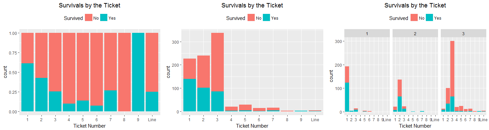<!-- -->

One interesting feature that we've discovered here is that passengers with the tickets that start with 1 had better chance. If we looked at the last gprah it's clear that tickets that start with 1 were more popular among 1st class, 2 with 2nd class and 3 with 3d class. 
So this variable could be highly correlated with the Pclass variable.

###5.3 Age groups - Kids & Adults

We've already cleaned Age values so let's just group them up into categories:


```r
full$Age.n[full$Age < 5] <- "<5"
full$Age.n[full$Age < 10 & full$Age >= 5] <- "5-10"
full$Age.n[full$Age < 20 & full$Age >= 10] <- "10-20"
full$Age.n[full$Age < 25 & full$Age >= 20] <- "20-25"
full$Age.n[full$Age < 28 & full$Age >= 25] <- "25-27"
full$Age.n[full$Age < 30 & full$Age >= 28] <- "28-29"
full$Age.n[full$Age < 33 & full$Age >= 30] <- "30-31"
full$Age.n[full$Age < 35 & full$Age >= 33] <- "32-34"
full$Age.n[full$Age < 40 & full$Age >= 35] <- "35-40"
full$Age.n[full$Age < 50 & full$Age >= 40] <- "40-50"
full$Age.n[full$Age < 100 & full$Age >= 50] <- "50+"
full$Age.n <- as.factor(full$Age.n)
full$Age.n <- factor(full$Age.n, levels = c("<5", "5-10", "10-20", "20-25", "25-27", "28-29", "30-31", "32-34", "35-40", "40-50", "50+"))
```


```r
p10 <- ggplot(data = full[!is.na(full$Survived),], aes(as.factor(Age.n), fill = as.factor(Survived))) +
     geom_bar(position = 'fill') +
     labs(x = "Age groups") +
     ggtitle("Survivals by the Age groups") +
     scale_fill_discrete(name = "Survived",
                         breaks = c(0,1),
                         labels = c("No", "Yes")) +
     theme(legend.position="top", plot.title = element_text(hjust = 0.5))

p11 <- ggplot(data = full[!is.na(full$Survived),], aes(as.factor(Age.n), fill = as.factor(Survived))) +
     geom_histogram(stat="count") +
     labs(x = "Age groups") +
     ggtitle("Survivals by the Age groups") +
     scale_fill_discrete(name = "Survived",
                         breaks = c(0,1),
                         labels = c("No", "Yes")) +
     theme(legend.position="top", plot.title = element_text(hjust = 0.5))
```

```
## Warning: Ignoring unknown parameters: binwidth, bins, pad
```

```r
grid.arrange(p10,p11, ncol = 2)
```

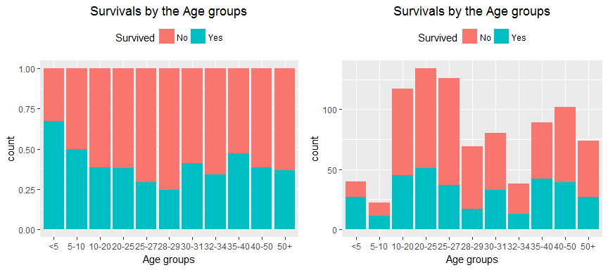<!-- -->

Using the same approach we can create a new column **Kid** for passengers who are yonger than 14. 


```r
full$Kid <- "Adult"
full$Kid[full$Age < 14] <- "Kid"
full$Kid <- as.factor(full$Kid)
```


```r
ggplot(data = full[!is.na(full$Survived),], aes(Kid, fill = as.factor(Survived))) +
     geom_bar(position = 'fill') +
     labs(x = "Kid or Adult") +
     ggtitle("Survivals by Kid/Adult") +
     scale_fill_discrete(name = "Survived",
                         breaks = c(0,1),
                         labels = c("No", "Yes")) +
     theme(legend.position="top", plot.title = element_text(hjust = 0.5))
```

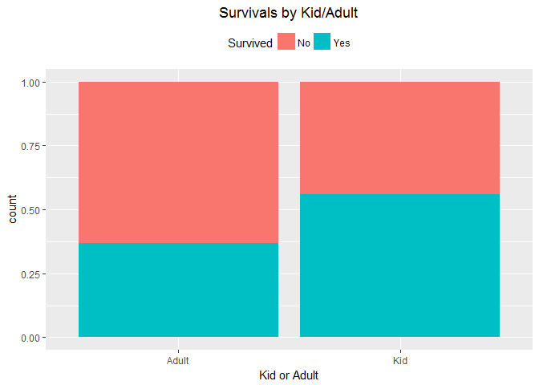<!-- -->

Great. Kids had better chance to survive

###5.4 Familty Size

Let's just combined siblings, parents, children and spouses together in the new variable **Family Size**
Besides this I also want to add another variable for people with at least 1 family mamber aboard.

```r
full$FamilySize <- full$SibSp + full$Parch
full$FamilySize <- as.factor(full$FamilySize)

full$Family <- ifelse(as.numeric(full$FamilySize) >= 2, "Yes","No") #Family = Yes if passenger has at least one family member aboard
full$Family <- as.factor(full$Family)
```


```r
p12 <- ggplot(data = full[!is.na(full$Survived),], aes(FamilySize, fill = as.factor(Survived))) +
     geom_bar(position = 'fill') +
     labs(x = "Familty Size") +
     ggtitle("Survivals by Family Size") +
     scale_fill_discrete(name = "Survived",
                         breaks = c(0,1),
                         labels = c("No", "Yes")) +
     theme(legend.position="top", plot.title = element_text(hjust = 0.5))

p13 <- ggplot(data = full[!is.na(full$Survived),], aes(as.factor(Family), fill = as.factor(Survived))) +
     geom_bar(position = 'fill') +
     labs(x = "Family aboard") +
     ggtitle("Survivals by Family Aboard") +
     scale_fill_discrete(name = "Survived",
                         breaks = c(0,1),
                         labels = c("No", "Yes")) +
     theme(legend.position="top", plot.title = element_text(hjust = 0.5))


grid.arrange(p12,p13, ncol = 2)
```

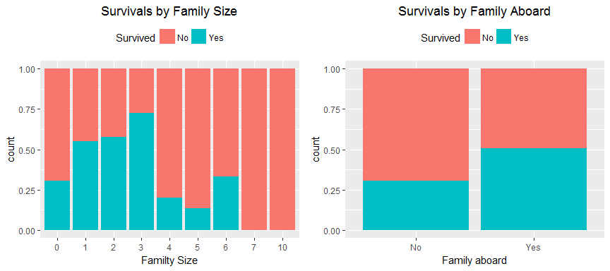<!-- -->

##6. Predictions

Creating validation data set 80/20 using *caret* package 


```r
train <- full[1:891,]
test <- full[892:1309,]
fullIndex <- createDataPartition(train$Survived, p=0.8, list=FALSE) #Split the data 20/80
data_train <- train[ fullIndex,]
data_val <- train[-fullIndex,]
```

Assigning Control and Metic characteristics. I will use 10-fold Cross Validation and we want our model to show us its Accuracy and Kappa rather than RMSE


```r
control <- trainControl(method="cv", number=10)
metric <- "Accuracy"
```

###6.1. Linear Discriminant Analysis

```r
set.seed(7)
fit.lda <- train(as.factor(Survived)~Pclass+Title+Age+Fare, data = data_train, method="lda", metric=metric, trControl=control)
fit.lda
```

```
## Linear Discriminant Analysis 
## 
## 714 samples
##   4 predictor
##   2 classes: '0', '1' 
## 
## No pre-processing
## Resampling: Cross-Validated (10 fold) 
## Summary of sample sizes: 642, 642, 642, 643, 642, 643, ... 
## Resampling results:
## 
##   Accuracy   Kappa    
##   0.7842136  0.5458887
```

###6.2. Classification and Regression Trees

```r
set.seed(7)
fit.cart <- train(as.factor(Survived)~Pclass+Title+Age+Fare, data = data_train, method="rpart", metric=metric, trControl=control)
fit.cart
```

```
## CART 
## 
## 714 samples
##   4 predictor
##   2 classes: '0', '1' 
## 
## No pre-processing
## Resampling: Cross-Validated (10 fold) 
## Summary of sample sizes: 642, 642, 642, 643, 642, 643, ... 
## Resampling results across tuning parameters:
## 
##   cp          Accuracy   Kappa    
##   0.02919708  0.8164319  0.6095901
##   0.05109489  0.7897887  0.5649193
##   0.43795620  0.6738263  0.2244145
## 
## Accuracy was used to select the optimal model using the largest value.
## The final value used for the model was cp = 0.02919708.
```

###6.3. k-Nearest Neighbors

```r
set.seed(7)
fit.knn <- train(as.factor(Survived)~Pclass+Title+Age+Fare, data = data_train, method="knn", metric=metric, trControl=control)
fit.knn
```

```
## k-Nearest Neighbors 
## 
## 714 samples
##   4 predictor
##   2 classes: '0', '1' 
## 
## No pre-processing
## Resampling: Cross-Validated (10 fold) 
## Summary of sample sizes: 642, 642, 642, 643, 642, 643, ... 
## Resampling results across tuning parameters:
## 
##   k  Accuracy   Kappa    
##   5  0.7060250  0.3712075
##   7  0.7073748  0.3723742
##   9  0.7016823  0.3552769
## 
## Accuracy was used to select the optimal model using the largest value.
## The final value used for the model was k = 7.
```

###6.4. Support Vector Machines (SVM)

```r
set.seed(7)
fit.svm <- train(as.factor(Survived)~Pclass+Title+Age+Fare, data = data_train, method="svmRadial", metric=metric, trControl=control)
fit.svm
```

```
## Support Vector Machines with Radial Basis Function Kernel 
## 
## 714 samples
##   4 predictor
##   2 classes: '0', '1' 
## 
## No pre-processing
## Resampling: Cross-Validated (10 fold) 
## Summary of sample sizes: 642, 642, 642, 643, 642, 643, ... 
## Resampling results across tuning parameters:
## 
##   C     Accuracy   Kappa    
##   0.25  0.7941510  0.5628499
##   0.50  0.8011346  0.5774952
##   1.00  0.8095070  0.5951916
## 
## Tuning parameter 'sigma' was held constant at a value of 0.6223082
## Accuracy was used to select the optimal model using the largest value.
## The final values used for the model were sigma = 0.6223082 and C = 1.
```

###6.5. Random Forest

```r
set.seed(7)
fit.rf <- train(as.factor(Survived)~Pclass+Title+Age+Fare, data = data_train, method="rf", metric=metric, trControl=control)
fit.rf
```

```
## Random Forest 
## 
## 714 samples
##   4 predictor
##   2 classes: '0', '1' 
## 
## No pre-processing
## Resampling: Cross-Validated (10 fold) 
## Summary of sample sizes: 642, 642, 642, 643, 642, 643, ... 
## Resampling results across tuning parameters:
## 
##   mtry  Accuracy   Kappa    
##   2     0.8150822  0.6047773
##   5     0.8445227  0.6689403
##   8     0.8207160  0.6196941
## 
## Accuracy was used to select the optimal model using the largest value.
## The final value used for the model was mtry = 5.
```

###6.6. Logistics Regression

```r
set.seed(7)
fit.glm <- train(as.factor(Survived)~Pclass+Title+Age+Fare, data = data_train, method="glm", metric=metric, trControl=control)
fit.glm
```

```
## Generalized Linear Model 
## 
## 714 samples
##   4 predictor
##   2 classes: '0', '1' 
## 
## No pre-processing
## Resampling: Cross-Validated (10 fold) 
## Summary of sample sizes: 642, 642, 642, 643, 642, 643, ... 
## Resampling results:
## 
##   Accuracy   Kappa    
##   0.7801252  0.5374883
```

###6.7 Results
Let's look at the results of all our models and plot the graph with Accuracy/Kappa.


```r
results <- resamples(list(lda=fit.lda, cart=fit.cart, knn=fit.knn, svm=fit.svm, rf=fit.rf, glm = fit.glm))
summary(results)
```

```
## 
## Call:
## summary.resamples(object = results)
## 
## Models: lda, cart, knn, svm, rf, glm 
## Number of resamples: 10 
## 
## Accuracy 
##           Min.   1st Qu.    Median      Mean   3rd Qu.      Max. NA's
## lda  0.7042254 0.7613948 0.7901017 0.7842136 0.8246283 0.8450704    0
## cart 0.7605634 0.7840376 0.8098592 0.8164319 0.8437500 0.8873239    0
## knn  0.6388889 0.6631455 0.6923905 0.7073748 0.7288732 0.8309859    0
## svm  0.7605634 0.7754304 0.8113263 0.8095070 0.8327465 0.8732394    0
## rf   0.7887324 0.8258509 0.8531886 0.8445227 0.8611111 0.8873239    0
## glm  0.7323944 0.7387031 0.7746479 0.7801252 0.8105927 0.8472222    0
## 
## Kappa 
##           Min.   1st Qu.    Median      Mean   3rd Qu.      Max. NA's
## lda  0.3769327 0.4957027 0.5537059 0.5458887 0.6234534 0.6826493    0
## cart 0.4808602 0.5338941 0.5979708 0.6095901 0.6685372 0.7574722    0
## knn  0.2500000 0.2783983 0.3363610 0.3723742 0.4068008 0.6414141    0
## svm  0.4956122 0.5172928 0.5975159 0.5951916 0.6555923 0.7291225    0
## rf   0.5485375 0.6239448 0.6903226 0.6689403 0.7071927 0.7574722    0
## glm  0.4281475 0.4537177 0.5286307 0.5374883 0.5961260 0.6826493    0
```

```r
dotplot(results)
```

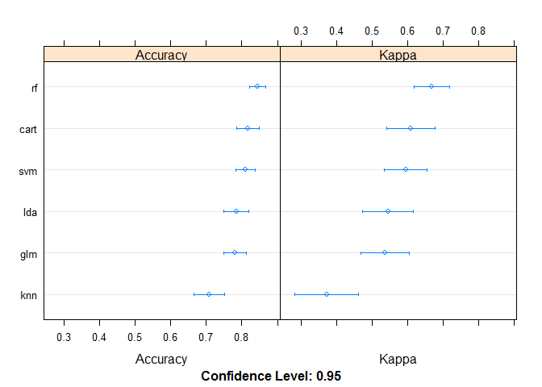<!-- -->

###6.8 Random Forest from **randomForest package**

```r
set.seed(7)
fit.rf1 <- randomForest(as.factor(Survived)~Pclass+Title+Age+Fare+Sex+FamilySize+Ticket.n+Family, data = data_train, ntree = 50)
fit.rf1
```

```
## 
## Call:
##  randomForest(formula = as.factor(Survived) ~ Pclass + Title +      Age + Fare + Sex + FamilySize + Ticket.n + Family, data = data_train,      ntree = 50) 
##                Type of random forest: classification
##                      Number of trees: 50
## No. of variables tried at each split: 2
## 
##         OOB estimate of  error rate: 17.09%
## Confusion matrix:
##     0   1 class.error
## 0 385  55   0.1250000
## 1  67 207   0.2445255
```

```r
(fit.rf1$confusion[1,1]+fit.rf1$confusion[2,2])/714 #Accuracy
```

```
## [1] 0.8291317
```

Ploting confusion matrix on the Random Forest (from **Caret** package), SVM and CART models (best performed models)


```r
confusionMatrix(predict(fit.rf, data_val), data_val$Survived)
```

```
## Confusion Matrix and Statistics
## 
##           Reference
## Prediction  0  1
##          0 98 19
##          1 11 49
##                                          
##                Accuracy : 0.8305         
##                  95% CI : (0.767, 0.8826)
##     No Information Rate : 0.6158         
##     P-Value [Acc > NIR] : 4.325e-10      
##                                          
##                   Kappa : 0.6337         
##  Mcnemar's Test P-Value : 0.2012         
##                                          
##             Sensitivity : 0.8991         
##             Specificity : 0.7206         
##          Pos Pred Value : 0.8376         
##          Neg Pred Value : 0.8167         
##              Prevalence : 0.6158         
##          Detection Rate : 0.5537         
##    Detection Prevalence : 0.6610         
##       Balanced Accuracy : 0.8098         
##                                          
##        'Positive' Class : 0              
## 
```

```r
confusionMatrix(predict(fit.svm, data_val), data_val$Survived)
```

```
## Confusion Matrix and Statistics
## 
##           Reference
## Prediction  0  1
##          0 98 20
##          1 11 48
##                                           
##                Accuracy : 0.8249          
##                  95% CI : (0.7607, 0.8778)
##     No Information Rate : 0.6158          
##     P-Value [Acc > NIR] : 1.304e-09       
##                                           
##                   Kappa : 0.6204          
##  Mcnemar's Test P-Value : 0.1508          
##                                           
##             Sensitivity : 0.8991          
##             Specificity : 0.7059          
##          Pos Pred Value : 0.8305          
##          Neg Pred Value : 0.8136          
##              Prevalence : 0.6158          
##          Detection Rate : 0.5537          
##    Detection Prevalence : 0.6667          
##       Balanced Accuracy : 0.8025          
##                                           
##        'Positive' Class : 0               
## 
```

```r
confusionMatrix(predict(fit.cart, data_val), data_val$Survived)
```

```
## Confusion Matrix and Statistics
## 
##           Reference
## Prediction  0  1
##          0 97 20
##          1 12 48
##                                           
##                Accuracy : 0.8192          
##                  95% CI : (0.7545, 0.8729)
##     No Information Rate : 0.6158          
##     P-Value [Acc > NIR] : 3.784e-09       
##                                           
##                   Kappa : 0.6093          
##  Mcnemar's Test P-Value : 0.2159          
##                                           
##             Sensitivity : 0.8899          
##             Specificity : 0.7059          
##          Pos Pred Value : 0.8291          
##          Neg Pred Value : 0.8000          
##              Prevalence : 0.6158          
##          Detection Rate : 0.5480          
##    Detection Prevalence : 0.6610          
##       Balanced Accuracy : 0.7979          
##                                           
##        'Positive' Class : 0               
## 
```

As we can see Random Forest has higher Accuracy (~84%)

Now I'm gonna use Random Forest model to fit on test data set to predict Survivals:


```r
fit.final <- randomForest(as.factor(Survived)~Pclass+Title+Age+Fare+Sex+FamilySize+Ticket.n+Family, data = train, ntree = 50)
predictions <- predict(fit.final, test)
x <- cbind(test$PassengerId, as.data.frame(predictions))
colnames(x) <- c("PassengerID", "Survived")
write.csv(x, "submission.csv", row.names = F)
```
